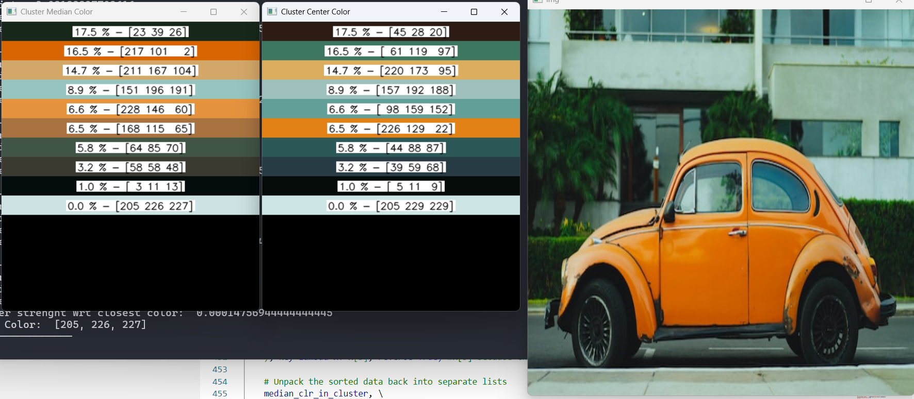
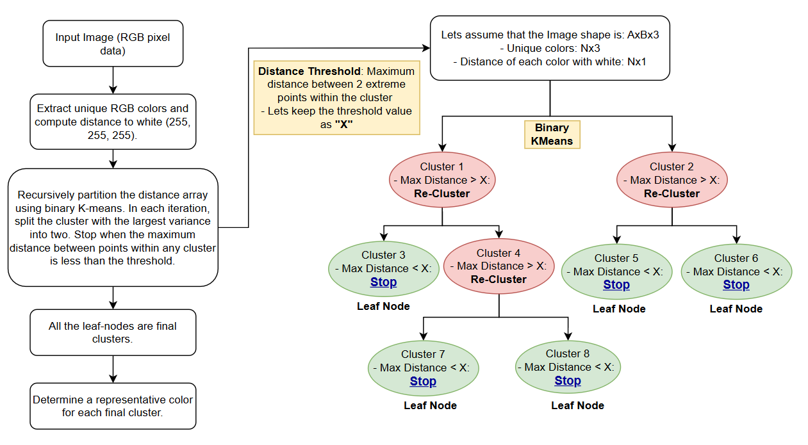
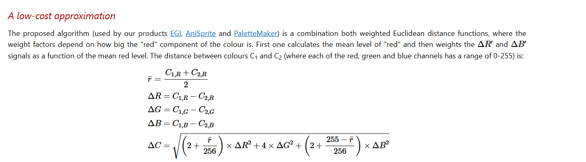
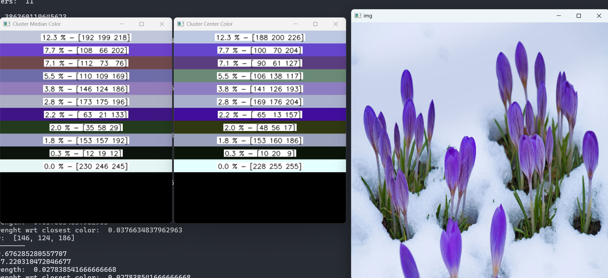

# Dynamic Color Quantization 

---

- **Co-Author:**  [Palash Nimodia](https://www.linkedin.com/in/palash-nimodia-94975b4b/) 
- **Date:** March 22, 2025
- **Code Link:** https://github.com/yogendra-yatnalkar/dynamic-color-quantization

> **Note**: This was originally developed in December 2021

---

## Introduction:


***This article presents a dynamic color quantization technique that intelligently reduces the number of colors in an image using K-means clustering and adaptive tree building. Learn how this method preserves visual detail without requiring you to specify the final number of colors in advance.***



Color quantization is a well-established technique, with solutions readily available in libraries like OpenCV. However, these methods often require you to predefine the exact number of colors desired. While dynamic alternatives exist, they often involve running K-means multiple times with different parameters and can require manual tuning and intuition to achieve optimal results. The dynamic color quantization method presented here elegantly addresses this issue by adaptively determining the number of clusters directly from the image data, without requiring you to specify the final color count beforehand.

## Process Flow:




**Walking Through the Process**

The algorithm flows through a series of carefully orchestrated steps to achieve its dynamic color quantization:

1.  **Color Extraction and Distance Calculation:**
    *   First, unique RGB colors are extracted from the image, and their distances from pure white are calculated. The implementation uses a custom function, `rgb_color_distance()`, which follows the CIE94 formula and is designed to better reflect human perception of color differences.

    * The formula comes from following article which is as follows: https://www.compuphase.com/cmetric.htm 
    

2.  **Distance Calibration:**
    *   The calibration step is more than just a normalization. It maps the color distances to a 0-100 scale, and the maximum possible color distance (between pure black \[0, 0, 0] and pure white \[255, 255, 255]) as per the chosen CIE94 distance metric, is approximately 764.

    *   By calibrating the distances to a 0-100 range, the `threshold` parameter becomes more intuitive. Instead of dealing with potentially large, abstract distance values, users can simply adjust a threshold between 0 and 100, representing the `*maximum allowable perceived color difference*` within a cluster. This makes it much easier to tune the algorithm for different images and desired quantization levels.

3.  **Building the Unbalanced Tree (`build_unbalanced_tree`):** This is the core of the algorithm, where the magic happens. The `build_unbalanced_tree` function recursively partitions the color space using binary K-means clustering.

    *   **Recursive Partitioning with K-means (on Distance Array):** The function *doesn't* directly cluster on the colors themselves. Instead, it starts with an array representing the distances of all unique colors from white. K-means (with *k*=2) is then used to split these distances into two initial clusters.

    *   **Iterative Clustering Until Threshold is Met:** As long as the maximum distance between any two colors *within a cluster* is still *above* the predefined `threshold`, the algorithm continues to apply K-means to that cluster. This recursive splitting continues until *all* clusters meet the threshold criterion.

    *   **Threshold-Based Stopping:** A key aspect of the algorithm is its stopping condition. It stops splitting a cluster when the maximum distance between any two colors within that cluster falls below a predefined `threshold`. This `threshold` parameter directly controls the granularity of the quantization: a smaller threshold results in more clusters and finer color detail.

    *   **Unbalanced Tree Structure:** As the algorithm progresses, it creates an *unbalanced* binary tree. Some branches might be split many times, while others stop early, depending on the distribution of colors. This is what makes the process "dynamic," adapting to the image's specific color characteristics.

    *   **Leaf Node Importance:** Each leaf node represents a final color cluster after the recursive splitting process is complete. These are the key building blocks of the quantized image.

    *   **Representative Color Selection within Leaf Nodes:** Determine a representative color for each final cluster.

        *   As shown in the example output, each leaf node is represented by both:
            *   **Cluster Median Color:** A color close to the median of the cluster.
            *   **Cluster Centroid Color:** A color closest to the cluster centroid.
        *   Choosing either the cluster median color or point close to the centroid lets the user experiment with different color selection to obtain varying results

    ```python

    def build_unbalanced_tree(arr, mapping_arr, threshold=10, percentile=5, debug_mode = False):
    """Builds an unbalanced binary tree by recursive k-means clustering of a 1D array,
       also handling a corresponding mapping array.

    Args:
      arr: The 1D NumPy array to cluster (shape n x 1).
      mapping_arr: The corresponding mapping array (shape n x 3).
      threshold: The maximum distance threshold for further splitting.

    Returns:
        A nested dictionary representing the tree structure.
    """
    if arr.size == 0:
        return {}

    if np.all(arr == arr[0]):
        return {
            "array": arr.tolist(),
            "mapping_arr": mapping_arr.tolist(),
            "center": None,
            "point_of_focus": None,
            "max_dist": None,
            "children": {},
        }

    root = {
        "array": arr,
        "mapping_arr": mapping_arr,
        "center": None,
        "point_of_focus": None,
        "max_dist": None,
        "children": {},
    }
    queue = deque([root])

    while queue:
        node = queue.popleft()
        current_array = node["array"]
        current_mapping_arr = node["mapping_arr"]

        labels, centers, max_distances = kmeans_cluster_1d_with_max_dist(current_array)

        for i in range(2):
            if max_distances[i] > threshold:
                cluster_points = current_array[labels == i]
                cluster_mapping_arr = current_mapping_arr[labels == i]
                cluster_center = centers[i]
                cluster_max_dist = max_distances[i]

                # Calculate the median distance
                median_distance = np.median(cluster_points)

                # Find the color closest to the median distance
                index_closest_to_median = np.argmin(np.abs(cluster_points - median_distance))
                # point_of_focus = cluster_mapping_arr[index_closest_to_median]

                # Calculate distances from each color to the median
                distances_to_median = np.abs(cluster_points - median_distance)

                # Get the indices of the colors closest to the median (5%)
                num_colors_to_avg = int(len(cluster_points) * (percentile / 100))
                if num_colors_to_avg == 0:
                    num_colors_to_avg = 1 # take a single one to prevent edge case

                closest_indices = np.argsort(distances_to_median)[:num_colors_to_avg]

                # Average the closest colors
                closest_colors = cluster_mapping_arr[closest_indices]
                point_of_focus = np.mean(closest_colors, axis=0).astype(np.uint8)

                # get the color which is closest to the center
                index_closest_to_center = np.argmin(
                    np.abs(cluster_points - cluster_center)
                )
                color_closest_to_center = cluster_mapping_arr[index_closest_to_center]

                child_node = {
                    "array": cluster_points,
                    "mapping_arr": cluster_mapping_arr,
                    "center": cluster_center,
                    "point_of_focus": point_of_focus,
                    "point_from_mapping_closest_to_center": color_closest_to_center,
                    "max_dist": cluster_max_dist,
                    "children": {},
                }
                node["children"][f"child_{i}"] = child_node
                queue.append(child_node)

                if(debug_mode):
                    print("====")
                    print("total cluster points: ", len(cluster_points))
                    print("index_closest_to_median: ", index_closest_to_median)
                    print("Num Colors to Avg: ", num_colors_to_avg)
                    print("closest indices as per median: ", closest_indices)

    return root

    ```

4.  **Leaf Nodes as Final Clusters:** Each leaf node in the tree represents a final color cluster.

5.  **Cluster strength with Image:** It helps to determine where the image cluster is more aligned and accordingly it can be sorted to represent from high to low.


7.  **Create color image and strength:** Create a representation of both colors along with their strength


### **Code Highlights**: 

*   `img_distance_with_white()`: Calculates the distances between each unique RGB color and the color white in the image.
*   `calibrate_array()`: Normalizes the computed distances between a range 0 to 100.
*   `kmeans_cluster_1d_with_max_dist()`: Performs binary K-means clustering on a 1D array of color distances, calculating the maximum distance within each cluster.
*   `build_unbalanced_tree()`: Recursively builds the unbalanced binary tree using K-means clustering, stopping when the maximum distance within a cluster is below the threshold.
*   `get_leaf_nodes()`: Retrieves all the leaf nodes from the generated tree.
*   `create_color_bars_with_numbers()`: Creates an image with horizontal color bars from a list of RGB colors and displays corresponding strength, arranging into multiple columns if needed.

## Advantages and Potential Improvements:

### Advantages of Dynamic Color Quantization

*   **Adaptive:** It's adaptive because it dynamically decides, based on the `threshold`, how many colors the input image should be represented with.
*   **Threshold-Controlled and Human-Perceivable:** The `threshold` parameter provides control over the level of quantization. The best part is that the threshold is inherently human-perceivable, even if the underlying distance metric changes because the distances are calibrated to a 0-100 range. Even more importantly, it's often the *only* parameter that needs to be tuned: the maximum allowed distance between any two colors within a cluster (relative to white).
*   **Fast and Reasonably Simple to Implement:** It's relatively simple to implement and very fast because everything is vectorized with NumPy. A key performance advantage comes from computing every color distance with white, allowing the clustering to operate on a single 1D array.

### Potential Improvements

*   **Optimizing the Distance Metric:** Explore other color distance formulas for potentially better perceptual results.
*   **More Sophisticated Representative Color Selection:** Instead of simply selecting the median, consider using a weighted average or a more advanced method to pick the most representative color for each cluster.
*   **Perceptual Thresholding:** Adapt the threshold based on human perception of color differences.

## Conclusion

Dynamic color quantization offers a powerful and flexible way to simplify images while preserving visual quality. By using K-means clustering in a hierarchical, adaptive manner, it provides a significant improvement over simpler color quantization methods. If you're looking for a smarter way to reduce the color palette of your images, this algorithm is definitely worth exploring!

---




