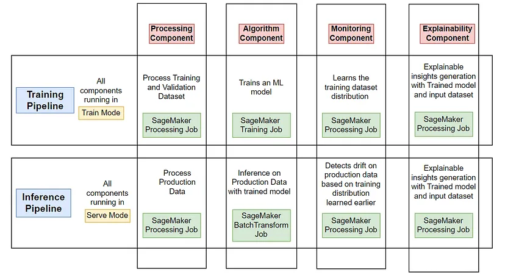
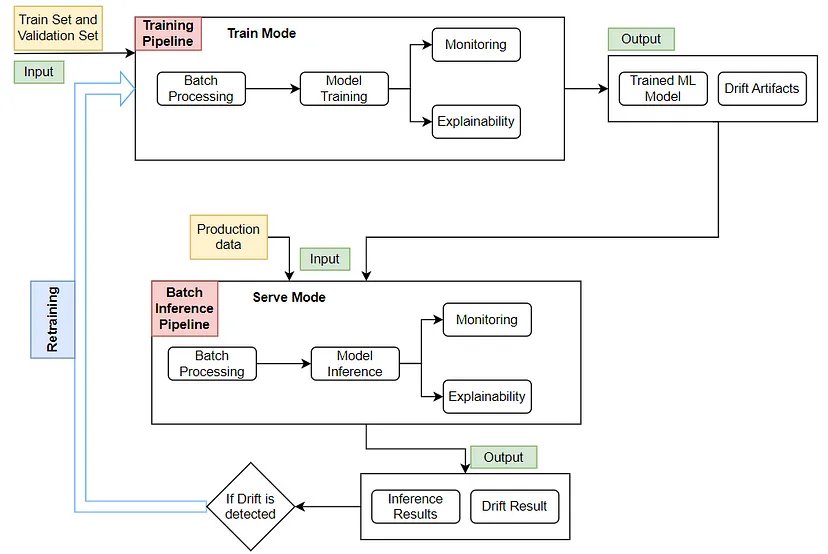
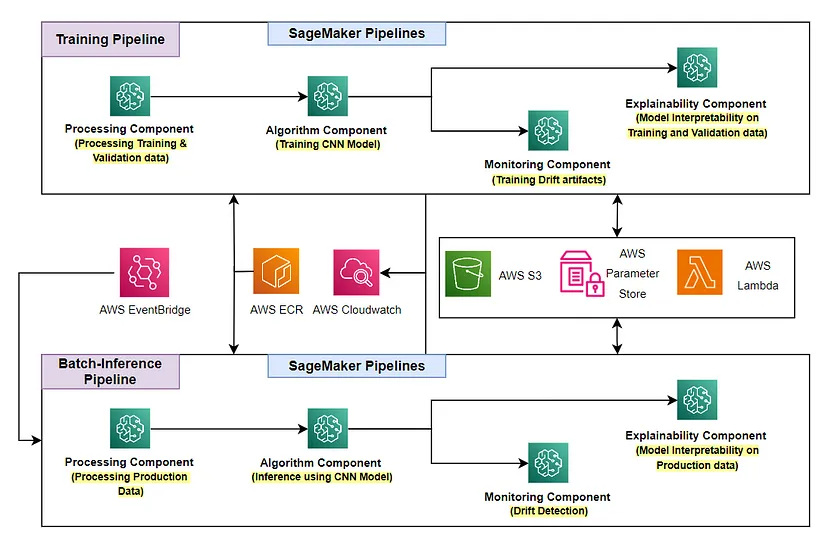

# End-to-End MLOps on AWS: Blog Series 

**Last Edit Date: December 26, 2023**

---

- **I had co-authored 3 blogs out of 7 blogs in total on the topic: *"End-to-End MLOps on AWS"*.**
- The blog series is hosted on Quantiphi's Medium Account
---

> **Other than Quantiphi's Medium account, the blogs are also hosted seperately on github as follows:**

### https://sagemaker-mlops-samples.github.io/

---

**Authors of the below 3 blogs:** 

- [Palash Nimodia](https://www.linkedin.com/in/palash-nimodia-94975b4b/) (Architect — Machine Learning)

- [Yogendra Yatnalkar](https://www.linkedin.com/in/yogendra-yatnalkar-2477b3148/) (Senior Machine Learning Engineer) at [Quantiphi](https://quantiphi.com/)

---

### 1. [Introducing End-to-End MLOps on AWS: Part1](https://medium.com/@datalab_70093/introducing-end-to-end-mlops-on-aws-part1-ae42dad5c487)

---

### 2. [End-to-End MLOps on AWS: Part2.1 - Computer Vision Simulation with Drift & Retraining](https://medium.com/@datalab_70093/end-to-end-mlops-on-aws-part2-1-computer-vision-simulation-with-drift-retraining-268f5033bb7f)

---

### 3. [End-to-End MLOps on AWS: Part2.2 - Computer Vision Components and Pipelines Deep Dive](https://medium.com/@datalab_70093/sagemaker-pipelinessagemaker-pipelinesend-to-end-mlops-on-aws-part2-2-c912cca9ef35)

---