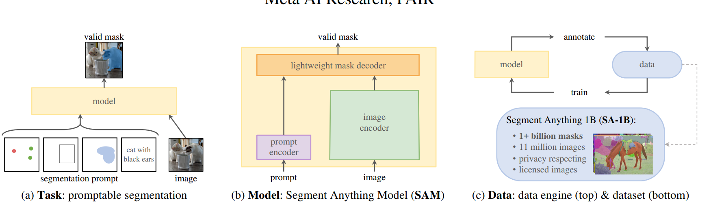
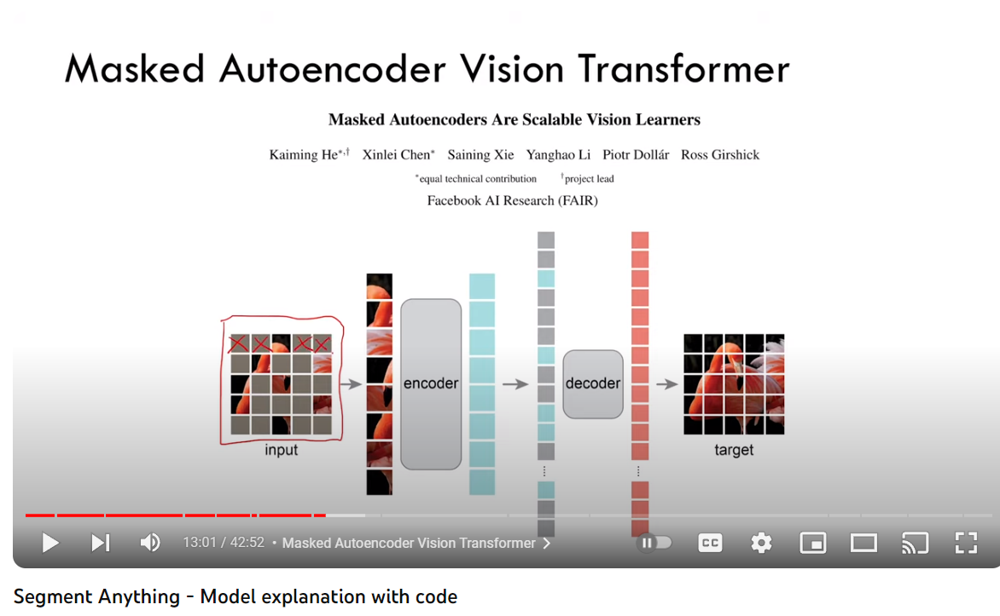
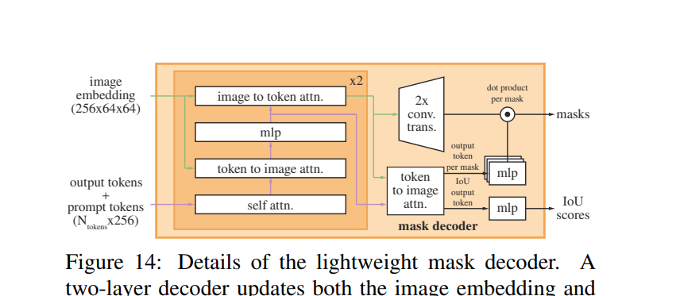
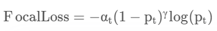

# Segment Anything (SAM)

|             |                                                        |
| ----------- | ------------------------------------------------------ |
| Last Edited | 16/07/2023                                             |
| Source:     | - Original Paper (notes till page no 7)                |
|             | - Youtube: https://www.youtube.com/watch?v=eYhvJR4zFUM |

---

## Introduction:

- Foundation  model for segmentation. 

- **Important thing to note here,** is that SAM is not just for semantic segmentation but can also be used for instance or panoptic or salient segmentation as well. We just need to engineer it accordingly.

- **Trained ON:** 11 million images and 1 billion corresponding masks

- Earlier foundation model: **Clip and Align** >> Now getting used in other downstream tasks like image generation **(DALL-E**). 

- To build foundation mode, 3 things are necessary: 
  
  - Task
  
  - Model
  
  - Dataset and Data-Engine
  
  ---

## Task

- **Task:** Prompt-able segmentation task >> prompt can be text or mask or BB or points >> even if prompt is not accurate or it is confusing, the output should be **good**.

- **Zero-shot transfer:** Example- if you have a OD model to detect cats, SAM can be used to segment each cat (instance segmentation) in your image. If you want semantic segmentation, convert that cat instances to single class. 

- **SAM vs Other multi-segmentation models:** 
  
  - Other models are not general. They do a set of predefined tasks they are trained on, they can be many but fixed. 
  
  - In case of SAM, it can be engineered to perform any task with itself alone or with other systems (example: OD model or older segmentation model). The prompt makes it key here and forms a general foundation model. 

---

## Model:

- **Model:** Heavy and powerful image encoder, light prompt encoder, light++ prompt and image decoder. 

- Import thing to note: for faster inference, the encoder can be hosted online on server, but prompt encoder and decoder can be hosted on edge (eg. browser). Hence reducing the network latency. **++** **We need to encode only once, then we can prompt it as many times as needed.**

- SAM predicts multiple masks for single image (to battle confusion)

- **Image Encoder:** Image encoder is pretrained **ViT from MAE (Masked Auto-Encoders are Scalable Vision Learners)**. In  MAE, random patches from ViT are masked and an autoencoder is trained to predict the masked patch. 
  
  
  
  **SAM uses this MAE encoder as its base encoder**

- **Prompt Encoder:** 
  
  - **Text:** Encoded using CLIP 
  
  - **Bounding box coordinates or point coordinates:**  Positional Encoder with summed learned embedding
  
  - **Mask**: Embedding from CNN

- **Mask Decoder:**
  
  - Inspired from **original Transformer decoder**. (modified)
  
  - Output of decoder goes to dynamic prediction head
  
  - Uses self-attention and cross-attention between prompt and image-embedding in bi-directional way (i.e prompt-to-image embedding and vice-versa)
  
  - Later, up-sample and pass it to a linear classifier 

- **Ambiguity and Backprop**: For each input, 3 masks are predicted and during backprop for loss computation, the mask with least amount of loss is counted. Loss is computed using IoU.
  
  

- **Efficiency:** Post encoder embedding, the prompt encoder and decoder can work on CPU (**web-browser**) with 50 ms latency. 

- **Loss metrics used:** *Focal loss and Dice Loss*
  
  - **Focal Loss:** Focal Loss is am improved version of Cross-Entropy Loss that tries to handle the class imbalance problem by down-weighting easy negative class and focusing training on hard positive classes. In paper, Focal Loss is mathematically defined as: 
    
    
    Reference: [Understanding Cross-Entropy Loss and Focal Loss | Multiplying Matrices for a living (theguywithblacktie.github.io)](https://theguywithblacktie.github.io/kernel/machine%20learning/pytorch/2021/05/20/cross-entropy-loss.html)  (Do read it, very good explanation)
    Note: Focal loss was initially used for object detection (invented at FAIR)
  
  - **Dice Loss:** Dice loss is 1 - Dice Coefficient. You can directly imagine Dice Coefficient as IoU. 

---

## Dataset

- **Dataset and Data-Engine:** 11 mil images, 1 billion masks. Tag with the help of model, retrain and retag --> Cycle continues...
  
  - **Responsible AI:** Images are taken from all over the globe across all human species.

---
