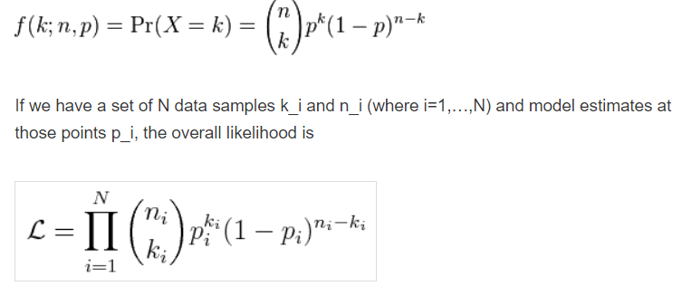
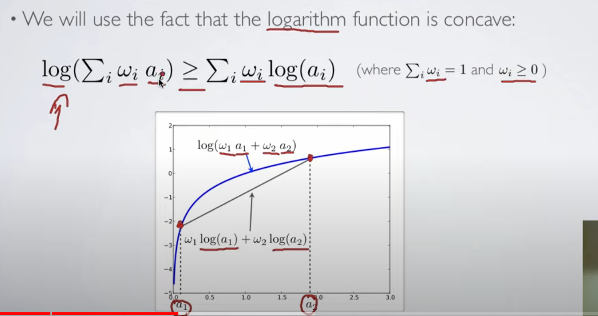

---
title: "Stable Diffusion Notes"
weight: 10
# bookFlatSection: false
# bookToc: true
# bookHidden: false
bookCollapseSection: false
bookComments: true
# bookSearchExclude: false
---

# Stable Diffusion Notes 

|             |            |
| ----------- | ---------- |
| Last Edited | 28/04/2024 |

---

 What is generative AI: Sampling from a latent probability distribution 
- Latent Space: Representation of a data-item in embedding space where similar items are close-by 

- Joint Probability: likelihood of 2 events occurring together 
	- Conditional Prob: For two events A,B: Prob of event B when event A has occurred
	- Marginalized Prob: For a joint prob between event A and B, what is the prob of event A irrespective of prob of event B
		- Lets say all possible value of event B are: B1, B2,.... Bn
		- Marginalized prob of event A = prob(A|B1)*prob(B1) + prob(A|B2)*prob(B2) ...... + prob(A|Bn)*prob(Bn)	

- Why the heck are we even going into joint probability instead of DDPM ? 
	- DDPM uses VAE where every pixel is a probabiltiy distribution in itself. 
	- So when we are generating one sample image, a given generated pixel value is dependent on all other pixel values (which makes sense, as the image is a grid of pixels, individual pixel values are dependent on its neighbours) 

- Binomail Distribution: 
	- Descrete probability distribution
	- This 	is a probabiltiy distribution which tell the probability of getting K successes in N trials
		- Note: Each trial is called a "Bernoulli Trail" 
		
		- 

	- Real life application: Helps in making a random judgement with limited amount of data 

	- My Notes from 3B1B video:
		- Binomial distribution works on probabilties with binary actions: (event Yes or event No --> Example: Coin Toss)
		- It tells us, **What is the probability of seeing a data sequence given  the probability of success** ---> **Which is likelihood itself i.e what is the likelihood of getting a sequence given a probability/probability-distribution is available**
			- Example: Imagine we have a fair coin with P(H) = 0.5, then what is the proability that if we toss it 10 times, there will be heads 8 times. 
			- From the above formulae: N = 10, k = 8, p = 0.5 --> 10C8 * 0.5**8 * 0.5**2 = 0.044
			- Only 4% chance that this sequence can occur --> This is possible as we have a fair coin 
			- Lets take another example, where out of 10 times, head will appear 6 times given P(H) is still 0.5
				- N=10, k=5, p=0.5 --> 	0.205 --> 20% likelihood 

## DDPM: 

### What is Nvidia's Progressive GAN
	- Progressive GAN: 
		- Normal GAN but start with: 4x4 block first, once this part is converged, go ahead
		- Next thing, noise will be 4x4 --> upsmaple: 8x8 --> Generator output: 8x8 --> Downsample 4x4 --> check with discriminator
		- Continue the above step from 4x4 and reach till desired state -- example: 1024x1024 
		- WHAT IT SOLVES:
			- It is difficult to converge any GAN and get even more difficult on larger images 
			- starting with small shape and going ahead helps 

### Inception Score: 
- Generate 30k images form the generative model 
- pass it through a inception network 
- Important: calculate the conditional and marginal probabiltiy distribution  
	- Conditional Probability Distribution: 
		- record all the values from the softmax layer for the 30K images inferrred 
		- The entropy in this case (for individual sample) should be high --> which means the model is confient in classifying the input --> which in short means the generated image is of quality for which the model is able to predict well (generated quality + object refineness)
	- Marginal Probability Distribution:
		- For thr 30k inferred probability scores per calls, avg per class 
		- The avg value is the Marginal probabiltiy
		- The entropy of marginal probability should be high which means the data has variety of samples 
		SIDE NOTE: At one place, I have also read that instead of avg the conditional probability, we infer from real images (fraction of images from every class) and avg from that (instead of using generated images) --> and this forms as the marginal probability aginst which the KL divergece will be calculated.
- Caluculate the KL divergence between 2 marginal distribution and Conditional distribution 
- KL divergence is the unsymmetric relative entropy between the 2 probability distributions
- IS score is: **e raise to KL divergence** 

FID SCORE (Yet to read in detail)

---

- Markov Chain Property: 
	- A mathematical framework containing a series of events, where the probability of each event depends on the immediately preciding event (and not on the entire series) 

- What is a Stochastic Process ? 
	- In Mathematics, a stochastic process is an event caused due to sequence of random variables in a given probability space 

- What is a diffusion process (actual definition):
	- the movement of molecules from region of higher concentration to regions of lower concentration 
	- In case of SD, it is a stochastic markov process having continuous sample path which converts our input from a complex distribution to a simple distribution (imgine from a complex image space (the one we look) to a standard normal gaussian noise) 

- Why SD is not called some variant of VAE and called diffusion specifically ? 
	- We are converting the input to a standard normal gaussian distribution which is similar to VAE, but in VAE, this happens in a single step and in our case, we are taking multiple steps to reach our end-goal where-in, each step is dependent on the previous step only. 
	- we are doing this in a hope that this is easier to converge as compared to VAE  

## Variational Bound: 
- Fact: Log is a concave function: 
	- 
	- https://www.youtube.com/watch?v=pStDscJh2Wo 

- What is likelihoood ? 
	- it measures how well a model fits the dataset  
	- For a given input, using a given model M, we predict with a probability p that the outcome will be o --> How can we trust this ? --> Likelihood helps us over here in determining the amount of trust. 
	- (Yogendra's explanation -- future readers, read it with a pinch of salt) So when we train a classification model, from first epoch itself we have a model with us which assigns a probability that a given object will be to some outcome o. Within the training process, we are maximising our turst on the model by using cross entropy loss (which is nothing but negative log-likelihood loss) 
	- Likelihood deals with fitting model, given some data 
	- Probability quantifies anticipation of outcome from a know distribution,
	- Likelihood quantifies trust in the model from which we assume the observed data is coming
	- https://hrngok.github.io/posts/likelihood/ 

For further catchup, read: https://xyang35.github.io/2017/04/14/variational-lower-bound/ 

## Extra notes:
- what is descritization of a function: Converting a continues function into descrete function or parts 	
- We converted a image from some space to gaussian space in a descrete number of steps 
	- in this process, we step by step, added small gaussian noise to the input and eventually, the input becomes gaussian noise itself. 
	- formula: xt = root(1 - beta_t)*x(t-1) * root(beta_t)*Gaussian_space(mean = 0, std = 1)
		-> Start with small beta_t ..... and eventually incease it 
		-> which shows that, at start the noise will be very less and at the last step, the (1-beta_t) will become 0 or close to 0, by which the input becomes 0 and the xt will be equal to some form of gaussain distribution (with full of noise) 
		- VAE does something similar, but it does it in a single step. **In VAE, when the image is generated back from multi-variate gaussian normal distribution (vector of mean and std), it happens in a single step. But you can imagine, since it has not learned the middle steps, the model will not converge well, which also means the generation quality will degrade.**
- The change of beta from t0 to time-step t take a linear schedule (and not a constant increase) --> that is because, till 70% of the process, the jumps should be higher (highest at the start) and when it is close to the end, the jumps should be very small. 
- Cross entropy is average of negative log-likelihood function. Log-likelihood explains how good a mathematical model fits a function 

---
---

## [Coding Stable Diffusion From Scratch in Pytorch - Umar Jamil](https://www.youtube.com/watch?v=ZBKpAp_6TGI)

- What is generative model ? 
	- Learn the prob dist of training data and during inference, samples from the learned dist
- The primary diffference between, mapping of image to gaussian step is a markov chain (sequence of events), instead of being a single event like VAE. 
- **Forward Process**: Adding noise to image in markov chain. But trick is, in forward process, we can jump from x0 to xt directly and there is not graidents/wts to learn
- **Reverse Process**: Removing noise from input one step at a time
- another thing to note is that: We just train NN to learn the SD.... even the variance part is fixed 
- The p(x) is therotically intractable i.e the marginalized probability which states the base image irrespective of value of its noise. 
- **Loss**: Like VAE, we compute ELBO (Evidence Lower Bound) and maximise it. 
- **Classifier Free Guidance**: 
	- how its used in reverse process:
- **Latent Diffusion Model**: 
	- using VAE 

