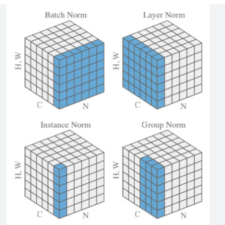
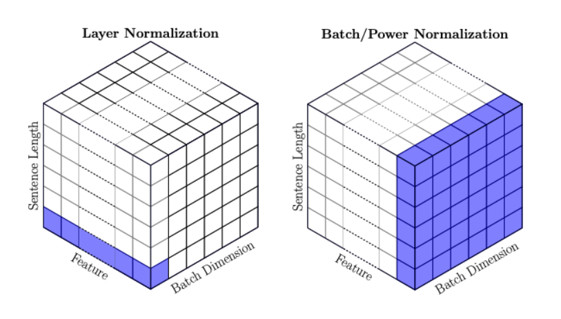
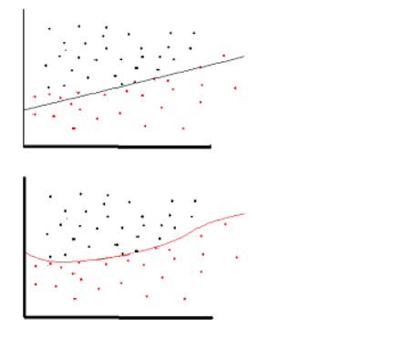
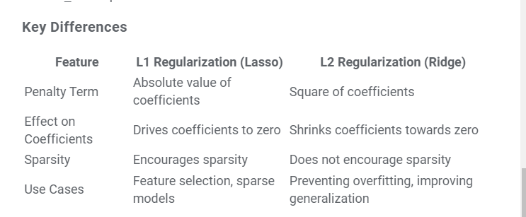

# Daily Scribble: 

Scribbling the content seen in the day: 

## January: 

- **vLLM:** Easy, fast, and cheap LLM serving for everyone
    - https://github.com/vllm-project/vllm 
    - Invented the concept of "**PagedAttention**"
    - uses **xFormer** internally, so indirectly uses FlashAttention and FlashAttention2 as well 
    - Has support for **continuous batching** (very useful for transformer/decoder architecture)
    - When released, claims to be much much faster than huggingface TGI. Now, even HF uses paged-attention for inference 

---

- **Fooocus:**
    - Fooocus is an image generating software. Fooocus is a rethinking of Stable Diffusion and Midjourney’s designs. 
    - **Made by the controlnet authors** 
    - Has direct support for colab and huggingface. **Made on gradio**
    - Looks quite good and easy to use: 
        - On early analysis, it looks like: it can do inpainting/outpainting and image-super-resolution as well. 

---

- **torchserve:**
    - Started with g4dn.xlarge instance type and model: ViT L16. Later updgraded to G4Dn.2xlarge to check the effect of increasing the CPU number and CPU memory. 
        - Played a lot of dynamic batching and worker count on single GPU. Came to 2 conclusion: 
            1. Dynamic batching helps (see below)
            2. On dynamic batching, once GPU utlization becomes 100%, no one can help later
        - **Conclusion**: Once gpu memory utilization is full, whatever we do, it wont increasing the actual load. 
        - **Importance of AWS elastic inference** (GPU as a service): Even though this ViT L16 is a medium level model with I believe update 300M params, 1 model only uses around 20 to 30% of the memory. With dynamic batching, the utilization is 100% even with 1 worker, so we are effectively not using memory at the fullest. 
    - Does Dynamic batching helps ? On g4dn:
        - Yes. When it was set to 1, the max RPS was 21
            - When batch-size was 1 but workers was also 1, the gpu utilization was around 85%
            - When workers were increased to 4 and batch-size was still 1, the gpu utilization became 100, but that did not affect the RPS. 
            - In both cases, the response time was slightly faster than dynamic batching. 
        - When it was set to 32, the max RPS was 32 
            - when dynamic batching is on, whatever is the worker count, it does no affect the RPS (for this model)

---

---

## February:

- **LLM Instruction Finetuning:** 
    - In general, it will have three things: 
        - **Task**: The task which LLM needs to perform
        - **Context**: Based on which an answer will be generated by the LLM for the above task
        - **Reponse**: The response generated by the LLM 
    - **How does Encoding look for 1 instructin:** 
        - Lets say the LLM is trained on 1024 tokens, then for a given instruction:
            - Lets suppose the task + context == 256 tokens
            - Lets say the response is of 256 tokens,
            - Then the instruction will be padded with 512 <EOS> tokens >> This will make the request to 1024 tokens in total
    - **How does the label look for above corresponding instruction:**
        - One important thing to note in instruction finetuning is that:
            - The gradients for Task and Context tokens should not be taken into consideration while performing  backpropogation 
                - Important Side NOTE: During normal supevised finetuning of LLM's on domain specific data for next-word prediction, we do not do this stuff. 
            - For skipping the Task+Context tokens, we will add "-100" for the first 256 tokens (from the above example). In Pytorch, for Cross-entropy loss, -100 is a constant number used, if we want to skip some region of input from contributing towards the gradient-decent process. 
    - **How does the attention mask is calcuated:**
        - From the above example of 1023 tokens: For the first 512 tokens, the attention mask should be 1. For the remaining 512 tokens the attention mask should have a value of 0. 
        - This means, we are telling the attention mask to not attend the EOS padded tokens. 

---

- **SHAP values:**
    - For a given record, we have following values: y_pred, y_test, x_pred --> if shape_val was the shap_values for the given x_pred and exp_val was the expected valulue for the entire set (which is nothing but the average of the y_pred) 
        - Then, **y_pred == sum(shap_value) + exp_val** 
    - The feature shap value is 0 if feature value is missing or null. 
    - While using XGBoost, if we are using the native library (Not the one integrated with SKlearn), we can get shap values directly from the predicted value. 
    - (with the help of Google Gemini) ***How are shap values computed ?*** (**NOTE:** Very high level explanation)  
        - First compute the baseline prediction value >>> which is nothing but the expected value for all the predictions (average of entire y_pred) 
        - ***Compute Marginal Contributions and Average:*** 
            - Suppose we had 4 features, and we have started with calculation of shap value for feature1: 
                - then compute all possible combination of feature 1 with other features 
                - like: (feature1), (feature1, feature2), (feature1, feature3), (feature1,2,3)..... etc etc
                - When we just consider feature1, all other values will be NULL or 0 in the input 
                - Calculate the contribute of every combination for a given feature and average those >>> This is the shap value for a given feature1 for a single record. 
                - Now, perform this for every feature for every record within the dataset. 

---

## April:

- **Layer Norm vs Batch Norm vs Instance Norm vs Group Norm:**
    - For CV: 
        - 
    - For NLP: 
        - Layer Norm for NLP (Transformers) looks exactly like **Instance Norm** of CV 
        - 

- **Residual Connection/Skip Connection:**
    - In skip connection, since we are adding the intial output to some further layer output, we should take care to keep the **h * w * c** same. 

## October:

- **Why do we need non-linearity in NN ?**
    - Non-linearity is needed in activation functions because its aim in a neural network is to produce a nonlinear decision boundary via non-linear combinations of the weight and inputs.
    - non-linear means that the output cannot be reproduced from a linear combination of the inputs (which is not the same as output that renders to a straight line--the word for this is affine). 
    - [Stackoverflow Link](https://stackoverflow.com/questions/9782071/why-must-a-nonlinear-activation-function-be-used-in-a-backpropagation-neural-net#:~:text=Non%2Dlinearity%20is%20needed%20in,of%20the%20weight%20and%20inputs.)
    - 

- **L1 and L2 Regularization:** 
    - Helps in model generalization 
    - L1 --> Lasso --> Loss = loss_fcn + gamma * (|wt1| + |wt2| + ...) --> Makes weights of less important feature as 0, hence useful for feature selection --> Geometry is square
    - L2 --> Ridge --> Loss = loss_fcn + gamma * sqrt(|wt1|**2 + |wt2|**2 + ...) --> shrinks wts towards 0 but not full 0 --> Geometry is circle 
    - 
