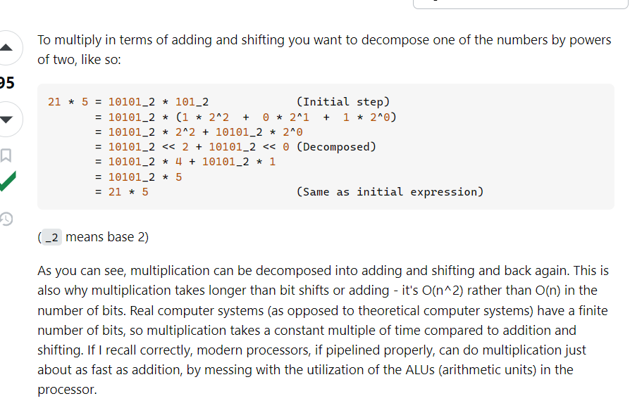

# DSA

### 1. Bitwise Operations for addition/subtraction/division/multiplcation:
Addition without using + operator: 
- a + b = ?
- xor_val = a ^ b
- and_val = a & b << 1
- while and_val != 0:
    - xor_val = xor_val ^ and_val
    - and_val = xor_val & and_val << 1
- return xor_val 

https://leetcode.com/problems/sum-of-two-integers/description/

**Multiplication (can be applied to division using right shift instead of left shift):**

https://stackoverflow.com/questions/2776211/how-can-i-multiply-and-divide-using-only-bit-shifting-and-adding/2777225#2777225 

### 2. Heap: 

**Heap is nothing but a priority queue**:
- Python has an inbuilt module for heap named: **heapq**
    - **Methods:** 
        - heapq.heappuush()
        - heapq.heappop()

- Problem on leetcode: https://leetcode.com/problems/maximum-number-of-events-that-can-be-attended/description/

- **Max Heap in Python**: 
    - Python heapq by default only supports **min-heap**.
    - To get a max-heap, multiply each number in the heap with **-1**.

#### 3. Array:

-  **Contunuous Subarray Sum**:
    - https://leetcode.com/problems/continuous-subarray-sum/?envType=daily-question&envId=2024-06-08 
    - The trick here is: *while continuously adding numbers to an exiting sum, at initial stage, if we have a remainder r1 for sum s1 (assuming we are deviding by some int k), if this same remainer r1 repeats at some point, it means, the numbers added after s1 are divisible by k*
    - ***Neetcode***: https://www.youtube.com/watch?v=OKcrLfR-8mE 

