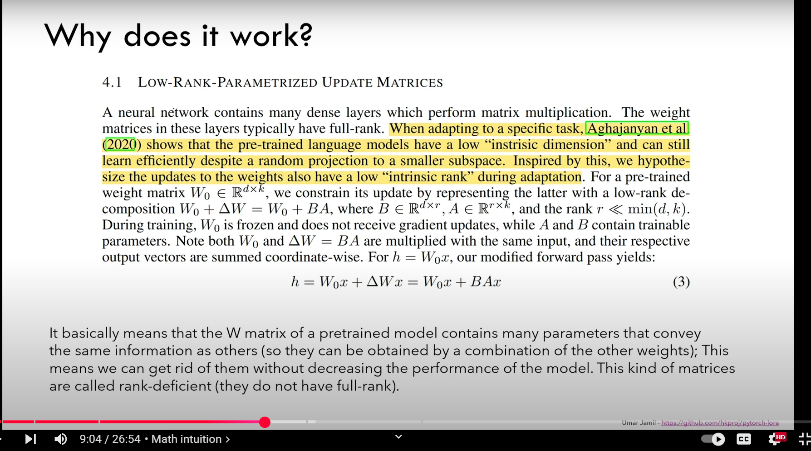

# Lower Rank Adaption (LoRA)

|             |            |
| ----------- | ---------- |
| Last Edited | 11/01/2025 |

---

> Sorce: https://youtu.be/PXWYUTMt-AU?si=-xwj93XkWPPv49Sp 



>> **NOTE:** I am watching the legend "Umar Jamil" but most of the written context below is copied from my conversation with **Gemini 2 Flash** 

## General information around rank of a matrix

- The rank of a matrix represents the number of **linearly independent** rows or columns it has.
**Example:**
Consider a 3x3 matrix with rows:
    - Row 1: [1, 0, 0]
    - Row 2: [0, 1, 0]
    - Row 3: [1, 1, 0]
        - Here, Row 3 is simply Row 1 + Row 2. Row 3 is *not* linearly independent, so the rank of this matrix is 2 not 3 because only 2 rows are linearly independent.

- By default, the weight matrices are **full-rank**. Full-rank means that the rows or columns of the matrix are linearly independent. In other words, none of the rows or columns can be formed as a combination of the others.
- **Rank-Deficient Matrices:**
    - The passage also talks about rank-deficient matrices. These are matrices that are not full-rank.
    - Specifically, it explains that the matrix W of the pre-trained model contains a lot of redundant information, so that many of the parameters convey the same information.
    - Because of this, they can be obtained by a combination of the other parameters, meaning that some rows or columns of the matrix can be expressed as a linear combination of the other rows or columns.
    - The fact that parameters can be gotten rid of without decreasing performance is a good way of illustrating that matrices are rank deficient.

>> **Aghajanyan et al. (2020) showed that pre-trained models can still learn well even when their weights are randomly reduced to a smaller space. This implies that the original weight matrices have redundancy, since the full space is not required for effective training.**

---

## Single Value Decomposition: 

- It is used to identify rank of a matrix
    - From Umar's video, SVD is not just used for rank identificatoin but even for identifying the 2 sub-matrices in LoRA like situations. Ex. if Matrix A = NxN, then Lora suggests 2 matrix of rank "r" where (r << N) such that: there are 2 submatrix of shape: (Nxr) and (rxN). These 2 matrix are made from: **U** and **V<sup>T<sum>**. (can be seen below). 
    - The rank is non-zero diagonal elements from sigma matrix 
    - For better explanation: https://github.com/hkproj/pytorch-lora/blob/main/svd.ipynb 
- Pasting what I quickly read from Gemini:

**SVD: A Quick Overview**

SVD is a powerful factorization technique that breaks down any matrix (let's call it 'A') into three other matrices:

   **A = U Σ V<sup>T</sup>**

Where:

*   **U:** An *m x m* orthogonal matrix (columns are orthonormal) where *m* is the number of rows of A.
*   **Σ (Sigma):** An *m x n* diagonal matrix, where *n* is the number of columns of A, containing the *singular values* of A. These are non-negative numbers, usually arranged in descending order. The diagonal can have zeros.
*   **V<sup>T</sup>:** The transpose of an *n x n* orthogonal matrix (rows are orthonormal).

**How SVD Relates to Rank**

The magic lies in the **singular values** (the diagonal elements of Σ):

*   **Rank = Number of Non-Zero Singular Values:** The rank of the original matrix 'A' is equal to the number of non-zero singular values in Σ.
    *   If Σ has two non-zero values (e.g., 5 and 2), the rank of A is 2.
    *   If Σ has three values (e.g., 7, 3, and 0), the rank of A is 2.

**Why is SVD Useful for Rank (and More)?**

1.  **Reliable Rank Determination:** SVD is more numerically stable than row reduction, especially when dealing with matrices that have near-zero values (which can cause rounding errors with row reduction). This is important for real-world data.

2.  **Reveals "Importance" of Dimensions:** The singular values tell you how much variance or "energy" is captured by each dimension/feature. Larger singular values correspond to more important directions.

3.  **Dimensionality Reduction:** You can approximate the original matrix by only using the largest singular values and their corresponding U and V columns. This is very common for reducing noise or decreasing dimensions in your data.

4.  **Pseudo-Inverse:** SVD provides a way to compute pseudo-inverses of non-square matrices, which is crucial for solving many types of equations.

**Example**

Let's take the previous matrix example and assume we computed the SVD (I will not show the computation here, but in practice, you use software to do it):

```
A =  [ 1  2  3 ]
     [ 2  4  6 ]
     [ 1  3  5 ]
```

The SVD might result in (approximately) something like:

*   **U**: 3x3 orthogonal matrix
*   **Σ (Sigma)** =
    ```
    [ 9.5  0    0 ]
    [  0   0.7  0 ]
    [  0    0   0 ]
    ```
*   **V<sup>T</sup>**: 3x3 orthogonal matrix

Notice the Sigma matrix has *two* non-zero singular values (9.5 and 0.7) this is in agreement with what we found through row reduction.

---

## Code Example: 

```python
class LoRAParametrization(nn.Module):
    def __init__(self, features_in, features_out, rank=1, alpha=1, device='cpu'):
        super().__init__()
        # Section 4.1 of the paper: 
        #   We use a random Gaussian initialization for A and zero for B, so ∆W = BA is zero at the beginning of training
        self.lora_A = nn.Parameter(torch.zeros((rank,features_out)).to(device))
        self.lora_B = nn.Parameter(torch.zeros((features_in, rank)).to(device))
        nn.init.normal_(self.lora_A, mean=0, std=1)
        
        # Section 4.1 of the paper: 
        #   We then scale ∆Wx by α/r , where α is a constant in r. 
        #   When optimizing with Adam, tuning α is roughly the same as tuning the learning rate if we scale the initialization appropriately. 
        #   As a result, we simply set α to the first r we try and do not tune it. 
        #   This scaling helps to reduce the need to retune hyperparameters when we vary r.
        self.scale = alpha / rank
        self.enabled = True

    def forward(self, original_weights):
        if self.enabled:
            # Return W + (B*A)*scale
            return original_weights + torch.matmul(self.lora_B, self.lora_A).view(original_weights.shape) * self.scale
        else:
            return original_weights
```