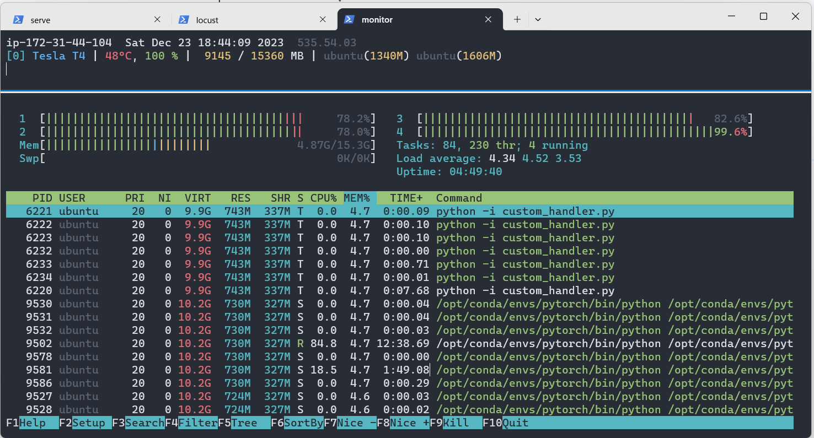
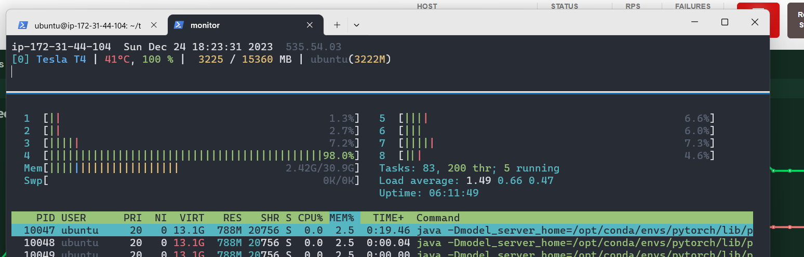

# Benchmarking Inference with Torchserve

|             |            |
| ----------- | ---------- |
| Last Edited | 24/12/2023 |

---

## Pytorch default - g4dn.xlarge

### Notes:

- **Instance Type: ml.g4dn.xlarge**
    - GPU: Nvidia T4
    - vCPU no: 4
    - CPU memory: 16 GB
    - GPU memory: 16 GB

- **Max RPS achieved: 32**
    - With various different configuration ranging from min/max worker = 1 to 4 and batch-size 4 to 32, the max RPS possible was only 32. 
        - Locust Configuration: Max Users: 200, Spawn Rate: 10 

- **Max Response time at 95th percentile: ~5-6 sec**

---





### Configuration:

```
enable_envvars_config=true
load_models=all
model_store=./model_store
models={\
  "vit_l_16": {\
    "1.0": {\
        "defaultVersion": true,\
        "marName": "vit_l_16.mar",\
        "minWorkers": 4,\
        "maxWorkers": 4,\
        "batchSize": 16,\
        "maxBatchDelay": 50\
    }\
  }\
}
```

---
---

## Pytorch default - g4dn.2xlarge

### Notes:

- **Instance Type: ml.g4dn.2xlarge**
    - GPU: Nvidia T4
    - vCPU no: 8
    - CPU memory: 32 GB
    - GPU memory: 16 GB

- **Max RPS achieved: 32**
    - With various different configuration ranging from min/max worker = 1 to 4 and batch-size 4 to 64, the max RPS possible was only around 32. 
        - Locust Configuration: Max Users: 200, Spawn Rate: 10 

- **Max Response time at 95th percentile: ~5-6 sec**    

---


- It can be noted that the GPU utilization is at 100% but the gpu memory is underutilized and the vCPU's are also unutilized
- Never the less, with any change in configuration in number-of-model-workers or batch-size or delay, the results and utilization numbers does not change.




### Configuration:

```
enable_envvars_config=true
load_models=all
model_store=./model_store
models={\
  "vit_l_16": {\
    "1.0": {\
        "defaultVersion": true,\
        "marName": "vit_l_16.mar",\
        "minWorkers": 1,\
        "maxWorkers": 1,\
        "batchSize": 64,\
        "maxBatchDelay": 200,\
        "responseTimeout": 240\
    }\
  }\
}
```