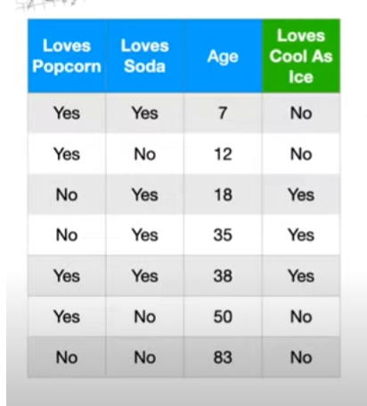

# Learning about Random Forest  

|             |            |
| ----------- | ---------- |
| Last Edited | 20/05/2024 |

---

## Decision Trees: 

Source: https://www.youtube.com/watch?v=_L39rN6gz7Y

Lets suppose the above is our data on which we are going to train a model: 

1. How will we choose our root node ? 
- With every column, try to classify the target. The column which gives the least gini index will be our root node
- Entropy can also be used as a replace for Gini index 
- **Note**: The tree nodes which does not have a clear boundry of classification, i.e does not classify 100% of the data into 2 distinct groups, they those nodes of the decision trees are known as impure nodes. The goal is that, by leaf node, the entire population should be clearly classifiable. 

2. Going ahead, the left and right node of the tree will be selected using similar step as above
- Select all the column which is not already indexed within a branch. For those columns, again compute the gini-index or entropy within its defined scope/strength. The next column will be column with minimum impurity.

**Note**: If the gini score or entorpy score i.e the impurity score of the node is less than its parent, then we will skip using that particular leaf node.

---