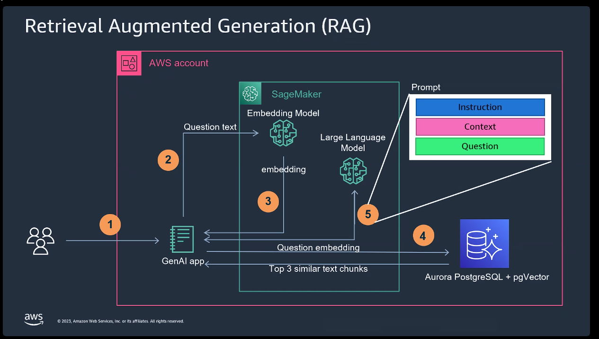
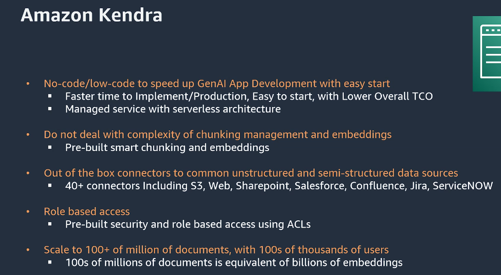
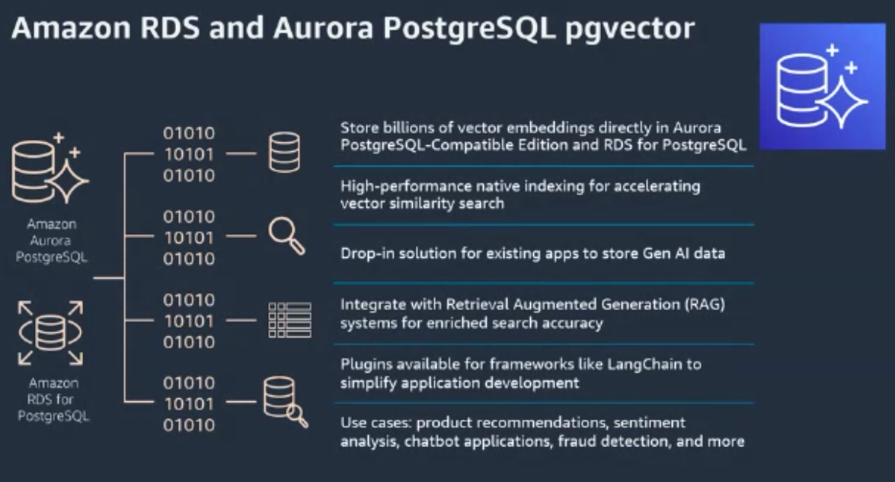
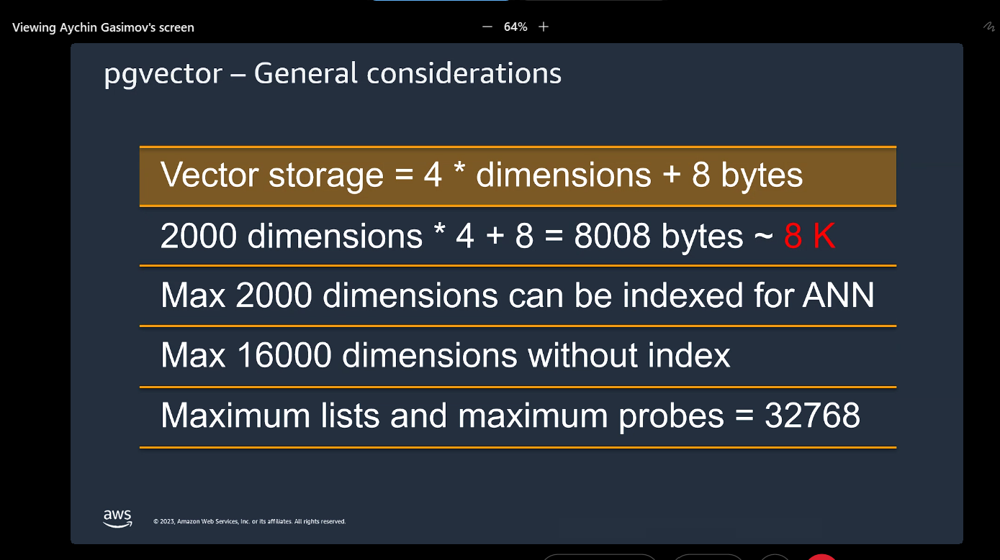

Note: Just putting down few notes from AWS partner-cast session 

---

# Vector Search and Vector Stores

### How to measure similarity in embeddings?

- **Cosine Similarity:** Gives the angle between the 2 embeddings. Higher the angle, bigger is the difference between 2 embeddings. 

- **Dot-Product:** Same as cosine similarity but gives us the magnitude between 2 vectors instead of direction/angle. 

### Real-life Use cases:

- Semantic search

- Recommendation System

- Anomaly detection and pattern recognition

- GenAI: RAG (Retrieval Augmented Generation)

### RAG Implementation in AWS:

- Vector embedding is used to find top 3 most similar chunks

- In the prompts, the context provided needs to be given in natural language i.e english and not in embeddings format

- 

- 

- Read about HNSW:  [Hierarchical Navigable Small Worlds (HNSW) | Pinecone](https://www.pinecone.io/learn/series/faiss/hnsw/) and [Nearest Neighbor Indexes: What Are ivfflat Indexes in pgvector and How Do They Work](https://www.timescale.com/blog/nearest-neighbor-indexes-what-are-ivfflat-indexes-in-pgvector-and-how-do-they-work/) 

- Vector search is read-only

- Read about: Knn search vs ANN search

- Read about: Postgres integration with aurora and rds for vector search

- 
