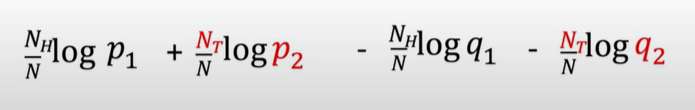
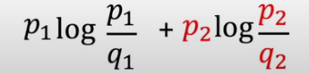

# Kullback-Leibler Divergence (KL Divergence)

### Definition:

- Measures the distance between 2 prabability distributions

### Explanation + Proof:

Base Video: [Intuitively Understanding the KL Divergence - YouTube](https://www.youtube.com/watch?v=SxGYPqCgJWM) 

Sequence of flips: **H -> H -> T .....**

Multiply the probabilities from both the coins for the corresponding heads and tails. It is nothing but: 

- for True coin: P1 raise to something and P2 raise to something else

- For coin2: Q1 raise to soemthing and Q2 raise to something else

- after applying log to the RHS: (** --> Explained at the end)
  
  

- As the number of observations tends towards infinity: 
  
  - **Nh/n ~~ p1**
  
  - **Nt/N ~~ p2**
  
  This leads us to the final log expression: 

#### General Fomulae:

  

  "This computes the distance between 2 distributions motivated by looking at how likely the 2nd distribution would be able to generate samples from the first distribution"

  **Cross-entropy Loss is very related to KL Divergence**

   ---

## ** Why take log of probability ?

  ***From the probabilities of ratio, why did we suddenly take log of ratio ??***

- The log of probabilities is closely related entropy. In [information theory](https://en.wikipedia.org/wiki/Information_theory "Information theory"), the **entropy** of a [random variable](https://en.wikipedia.org/wiki/Random_variable "Random variable") is the average level of "information", "surprise", or "uncertainty" inherent to the variable's possible outcomes.
  
  
  
  ##### KL Divergence is also known as relative entropy between 2 distributions.
