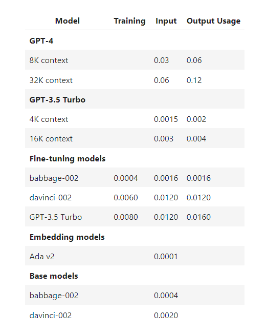

# NLP General:

- I will keep on appending stuff which I read about NLP as and when I get time in this place
- This is mainly intended for two things: 
  - Quick glance on what I had read in past for a given topic
  - If needed to deep-dive, just look at the sources I used while reading it for the first time

---

--- 

## Hackers Guide to Language Model:

Source: [A Hackers&#39; Guide to Language Models - YouTube](https://www.youtube.com/watch?v=jkrNMKz9pWU) 

Notebook: [GitHub - fastai/lm-hackers: Hackers&#39; Guide to Language Models](https://github.com/fastai/lm-hackers) 

Date: 02/11/2023

---

- On a high note, what is a language mode: 
  
  - Predicts the next word
  
  - or predicts the missing word

- Byte-Pair-Encoding tokenizer for OpenAI models: [GitHub - openai/tiktoken: tiktoken is a fast BPE tokeniser for use with OpenAI&#39;s models.](https://github.com/openai/tiktoken) 

- "NN has got the ability to create rich hierarchy of abstractions and representations on the base training data which is clearly a form of **knowledge compression.**"

- 

- LM's (mainly LLM's) are trained in 3 parts: 
  
  - ***Pretrained:*** Unsupervised training on large corpus of data and building a generalized model. The tasks can be: 
    
    - Next word prediction
    
    - Mask word and predict the masked word
  
  - ***LLM Fine-Tuning:*** Again **unsupervised training like next word prediction**, but on small amount of task-specific data 
    - **Note**: In Computer vision mainly, when we say fine-tuning, we usually train only a small part of model (usually last few layers) again. **But in the case of LLM's, we retrain the entire Model.**
    
    - Within this second step, the paradigm has recently shifted to **Instruction Finetuning**. In this, the input text is of the form: *Instruction --> Context --> Question*. For further knowledge, a good source is: [Instruction Fine-tuning of Large Language Models | Niklas Heidloff](https://heidloff.net/article/instruct-tuning-large-language-models/) 
    
    - Llama2-chat models are instruction fine-tuned where the instruction of llama2-chat is quite long for example: 
      
      - ```
        You are a helpful, respectful and honest assistant. Always answer as helpfully 
        as possible, while being safe. Your answers should not include any harmful, 
        unethical, racist, sexist, toxic, dangerous, or illegal content. Please ensure 
        that your responses are socially unbiased and positive in nature. If a question 
        does not make any sense, or is not factually coherent, explain why instead of 
        answering something not correct. If you don’t know the answer to a question, 
        please don’t share false information.
        
        <<CONTEXT>>
        
        Question: <<Question>>
        ```
  
  - ***Classifier fine-tuning:*** 
    
    - Reinforcement Learning with Human Feedback:
      
      - Good source to learn is from Yannick's video: [Learning to summarize from human feedback (Paper Explained) - YouTube](https://www.youtube.com/watch?v=vLTmnaMpQCs&pp=ygUUWWFubmljayBraWxjaGVyIFJMSEY%3D) (This is the original paper released in 2020 by OpenAI)
        
        - From my current understanding, there will be a separate scoring model
        
        - The LLM would generate some output for the input and scoring model will generate the score for the output. 
        
        - The scoring model will be trained on small supervised data where the scores are generated by humans.

- As of September 2023, GPT4 is the best SOTA LLM. Listing down few things which GPT4 cannot do: 
  
  - Hallucinations
  
  - It doesn't know about itself. (Why not?)  --> Because it was not included in its training and due to RLHF, it is just hallucinating 
  
  - It doesn't know about URLs. 
  
  - Knowledge cutoff

- **OpenAI Cost:**



- **Small Note on GPU Performance per price:**
  
  - Higher priced GPU is not always as good as its price because we need GPU having ultra-fast memory transfer speed as compared to ultra-fast compute operations. 

-----------

---

## How to make inference faster in Casual Language Model:

- To increase performance of LLM prediction, we should try to reduce output tokens as compared to input tokens. It will have **HUGE Impact**. 

- KV Cache 

- Continuous Batching (different than dynamic batching)

- Paged Attention

- For Nvidia GPUs, use dtype: **bfloat16** instead of **fp16**. The "blfoat16" dtype is Nvidia Sepecfic which uses more memory but prvides faster compute. 

- Flash Attention (v2 at the time of writing) --> Need to confirm if the principles of Flash-Attention are also application to non-Nvidia GPU's. Eg: Inferentia/TPU

- 

---

---
