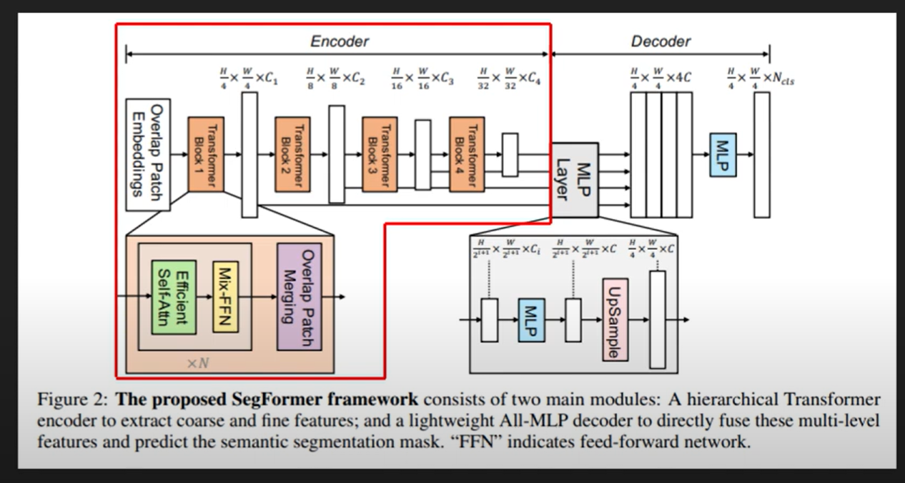
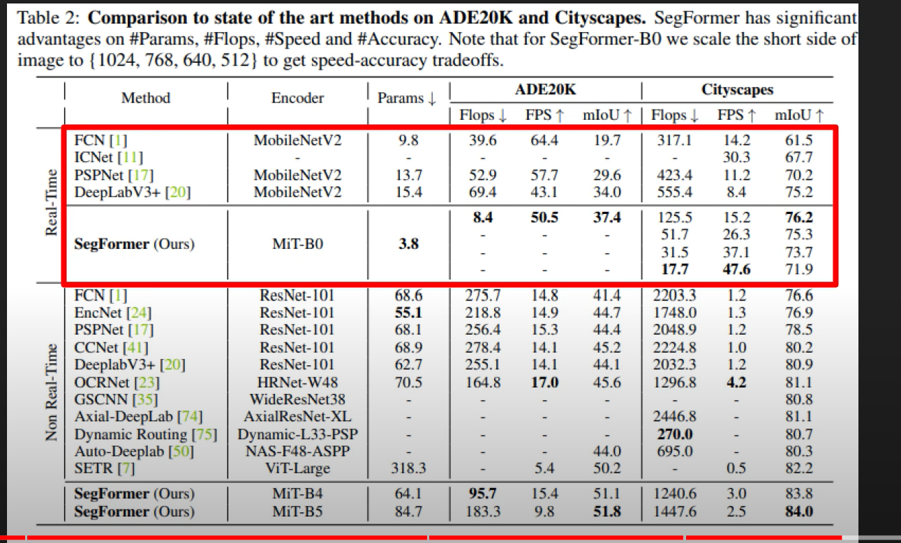

# SegFormer: Segmentation using Transformer

|             |            |
| ----------- | ---------- |
| Last Edited | 16/07/2023 |

---

Source: [SegFormer: Simple and Efficient Design for Semantic Segmentation with Transformers - YouTube](https://www.youtube.com/watch?v=hz3MO1j-wB4)

- Input patch size: **4x4**
  
  - In ViT, it was 16x16, but with smaller path size, the authors said, smaller batch size is better (and required) for dense prediction.
  
  - **Note:** With reducing the patch size, the computation increases. 

- After each transformer block (encoder in this case), there is a feed-forward block which is mainly used to lower the dimension like older UNet --> i.e in HxWxC .... as we go ahead in the encoder block, the height and width will decrease but the number of channels will keep on increasing. 
  
  - In normal ViT as well, there are multiple transformer blocks, output dimension of each block of encoder is same its input. 
  
  - These MLP blocks used in the encoder (Not transformer encoder), not just downsample the input (and increase channels) but also dynamically adjusts the patch embedding vector passed on to the next transformer block. 

- **Efficient self-attention reduces the sequence to lower computation cost** (NOTE: Later need to read about efficient self attention)

- The segformer decoder consists of Dense NN (MLP) which has upsamping blocks in between. 

- 

---

***Important: One big achievement of segformer is, it not just has high mIoU, its Params size is also very small..... hence inference speed is also high.***

---
